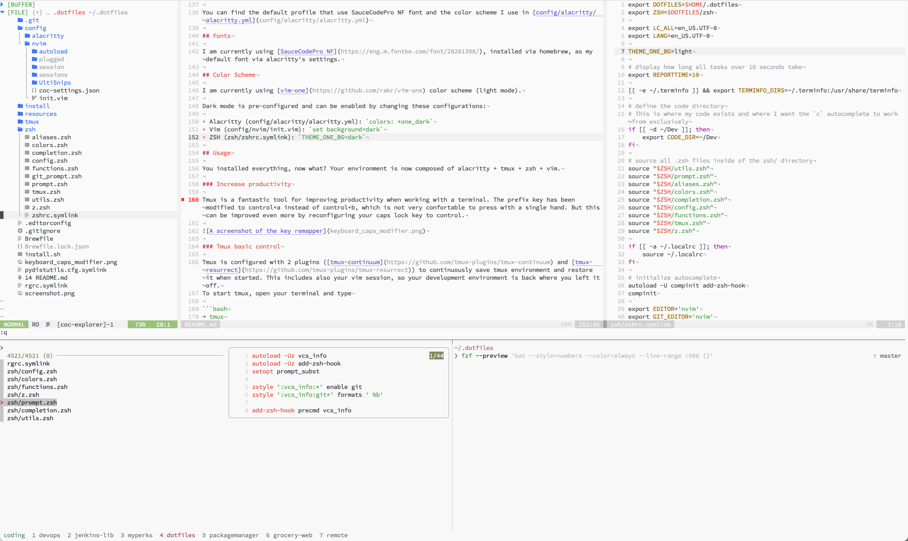
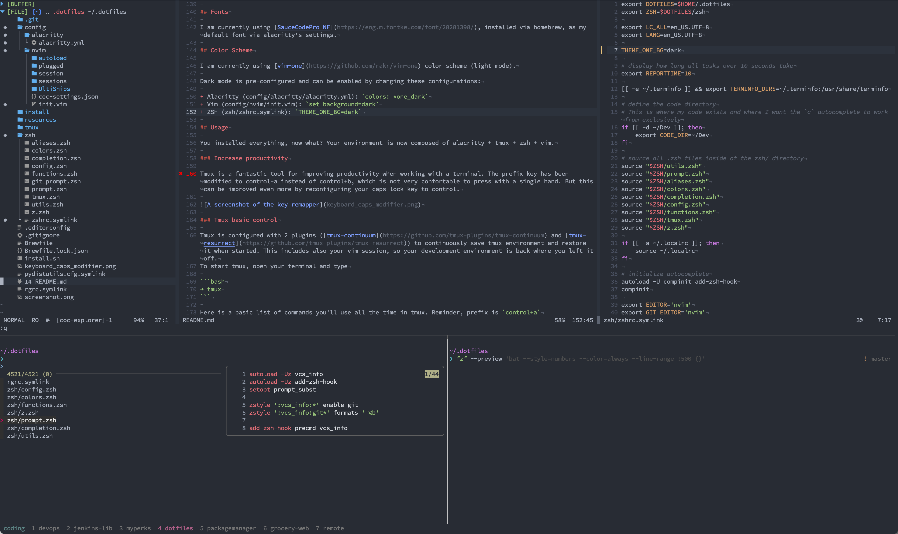

# Dotfiles

A collection of neovim, tmux, and zsh configurations for macOS. Built for DevOps workflows with Terraform, Python, YAML, and JSON.



## Contents

+ [Setup and Installation](#setup-and-installation)
+ [Terminal Capabilities](#terminal-capabilities)
+ [ZSH Setup](#zsh-setup)
+ [Neovim Setup](#neovim-setup)
+ [Tmux](#tmux-configuration)
+ [Terminal](#terminal-configuration)
+ [Fonts](#fonts)
+ [Color Scheme](#color-scheme)
+ [Usage](#usage)
+ [Claude Code](#claude-code)
+ [Troubleshooting](#troubleshooting)

## Setup and Installation

Clone the dotfiles repository to your home directory as `~/.dotfiles`.

```bash
git clone https://github.com/puffin/dotfiles.git ~/.dotfiles
cd ~/.dotfiles
```

### Backup

Run `install/backup.sh` to back up any existing symlinked files to `~/dotfiles-backup`. The installation scripts will not overwrite existing files.

### Installation

Install XCode CLI tools and Homebrew first:

```bash
xcode-select --install
```

Follow instructions at https://brew.sh/ to install Homebrew, then:

```bash
./install.sh
```

This will:
- Initialize git submodules
- Symlink all `*.symlink` files to your home directory (e.g. `zshrc.symlink` becomes `~/.zshrc`)
- Symlink the `config` directory contents to `~/.config/`
- Install Homebrew packages from `Brewfile`
- Run macOS-specific configurations via `install/osx.sh`

## Terminal Capabilities

To support italic fonts in tmux:

```bash
tic -x resources/xterm-256color-italic.terminfo
tic -x resources/tmux.terminfo
```

## ZSH Setup

ZSH is configured in `zshrc.symlink`. Key features:

+ `EDITOR` set to `nvim`
+ Zinit plugin manager for zsh plugins
+ Sources `~/.localrc` for machine-specific config (API keys, etc.)
+ Custom prompt with git status on `RPROMPT`

### Git Prompt Symbols

+ `+` New files added
+ `!` Existing files modified
+ `?` Untracked files
+ `>>` Files renamed
+ `✘` Tracked file deleted
+ `$` Stashed files
+ `=` Unmerged files
+ `⇡` Branch ahead of remote
+ `⇣` Branch behind remote
+ `⇕` Branches diverged
+ `✔` Working directory clean

## Neovim Setup

Neovim is configured entirely in Lua with the following structure:

```
~/.config/nvim/
├── init.lua                  -- Entry point
└── lua/user/
    ├── options.lua           -- Editor settings
    ├── keymaps.lua           -- Key mappings
    ├── autocmds.lua          -- Autocommands
    ├── plugins.lua           -- Plugin declarations (lazy.nvim)
    └── lsp.lua               -- LSP server configuration
```

Plugins are managed by [lazy.nvim](https://github.com/folke/lazy.nvim) and installed automatically on first launch. Run `:Lazy` inside neovim to manage plugins.

### LSP and Autocompletion

Language servers are managed by [Mason](https://github.com/williamboman/mason.nvim) and configured via Neovim's native `vim.lsp.config` (0.11+). Autocompletion is powered by [blink.cmp](https://github.com/saghen/blink.cmp).

| Language   | Server        | Features                                    |
|------------|---------------|---------------------------------------------|
| Terraform  | terraformls   | Completions, diagnostics, prefill required fields |
| Python     | pyright + ruff| Pyright for completions/types, Ruff for linting/formatting |
| YAML       | yamlls        | Schema-aware completions (K8s, Docker Compose, GitHub Actions, etc.) |
| JSON       | jsonls        | Schema-aware completions (package.json, tsconfig, etc.) |

Schemas are provided by [SchemaStore.nvim](https://github.com/b0o/SchemaStore.nvim) (300+ schemas).

**Note:** For Terraform, run `terraform init` in each project directory for provider-aware completions.

### LSP Keymaps

| Key            | Action              |
|----------------|---------------------|
| `gd`           | Go to definition    |
| `gy`           | Go to type definition |
| `gi`           | Go to implementation |
| `gr`           | Find references     |
| `K`            | Show documentation  |
| `<leader>rn`   | Rename symbol       |
| `<leader>ca`   | Code action         |

### Completion Keymaps

| Key         | Action                |
|-------------|-----------------------|
| `Tab`       | Next completion       |
| `S-Tab`     | Previous completion   |
| `CR`        | Confirm selection     |
| `C-Space`   | Trigger / toggle docs |
| `C-e`       | Dismiss completion    |
| `C-b / C-f` | Scroll documentation  |

### Diagnostics

Diagnostics show inline virtual text, gutter signs, and underlines. Holding the cursor on an error line auto-opens a floating window with the full message.

### Plugins

**UI**: vim-one (colorscheme), lualine (statusline), nvim-web-devicons, vim-smoothie (smooth scrolling)

**Editor**: vim-surround, vim-repeat, vim-unimpaired, vim-sleuth, vim-abolish, Comment.nvim, splitjoin.vim, nvim-autopairs, editorconfig

**Git**: fugitive, gitsigns, diffview.nvim, vim-flog, vim-twiggy

**Navigation**: FZF (files, buffers, ripgrep), nvim-tree (file explorer)

**Session**: vim-obsession + vim-prosession (auto-save/restore sessions)

**Syntax**: Treesitter with parsers for Terraform, HCL, Python, TypeScript, JSON, YAML, Lua, and more

## Tmux Configuration

Tmux is configured in `~/.tmux.conf` with prefix set to `control+a`. Sessions are automatically saved and restored via tmux-continuum and tmux-resurrect.

### Tmux Commands

| Key                         | Action                    |
|-----------------------------|---------------------------|
| `prefix + I`                | Install plugins           |
| `prefix + U`                | Update plugins            |
| `prefix + w`                | Window/pane selection     |
| `prefix + c`                | New window                |
| `prefix + ,`                | Rename window             |
| `prefix + &`                | Kill window               |
| `prefix + [1-9]`            | Select window             |
| `prefix + -`                | Split vertically          |
| `prefix + \|`               | Split horizontally        |
| `prefix + x`                | Kill pane                 |
| `prefix + [h,j,k,l]`       | Move to pane              |
| `prefix + z`                | Toggle pane fullscreen    |
| `prefix + shift + [h,j,k,l]` | Resize pane             |

## Terminal Configuration

Terminal of choice is [Alacritty](https://alacritty.org/). Configuration is in `config/alacritty/alacritty.yml`.

## Fonts

[SauceCodePro NF](https://eng.m.fontke.com/font/28281398/), installed via Homebrew.

## Color Scheme

[vim-one](https://github.com/rakr/vim-one) in light mode. Comments are displayed in light grey italic.

Dark mode can be enabled by changing:

+ Alacritty: `colors: *one_dark`
+ Neovim: `vim.opt.background = "dark"` in `plugins.lua`
+ ZSH: `THEME_ONE_BG=dark`

### Dark Theme



## Claude Code

[Claude Code](https://docs.anthropic.com/en/docs/claude-code) is integrated into Neovim via the [claudecode.nvim](https://github.com/coder/claudecode.nvim) plugin, providing an in-editor AI assistant panel.

### Claude Code Keymaps

Leader key is `Space`.

| Key              | Action                      |
|------------------|-----------------------------|
| `<leader>ac`     | Toggle Claude Code panel    |
| `<leader>as`     | Send selection to Claude    |
| `<leader>aa`     | Add current file to Claude  |
| `<C-w>`          | Navigate away from terminal (e.g. Claude panel) |

## Usage

### Vim Quick Reference

Leader key is `Space`.

| Key              | Action                      |
|------------------|-----------------------------|
| `<leader>k`      | Toggle file explorer        |
| `<leader>st`     | Start screen                |
| `<leader>b`      | Close buffer (keep split)   |
| `<leader>t`      | Git file finder             |
| `<leader>e`      | All files finder            |
| `<leader>r`      | Buffer finder               |
| `<leader>s`      | Git status files            |
| `:Rg`            | Ripgrep search              |
| `<leader>gs`     | Git status                  |
| `<leader>gd`     | Git 3-way diff              |
| `gdh` / `gdl`   | Take left/right in diff     |
| `<leader>dvo`    | Open Diffview               |
| `<leader>dvc`    | Close Diffview              |
| `<leader>dvh`    | Diffview file history       |
| `]g` / `[g`      | Next/previous git hunk      |
| `gs`             | Preview git hunk            |
| `gu`             | Reset git hunk              |
| `gc` / `gcc`     | Comment toggle              |

### Zsh Shortcuts

| Key                | Action                          |
|--------------------|---------------------------------|
| `Alt + Right/Left` | Move one word forward/backward  |
| `Cmd + Right/Left` | Move to end/beginning of line   |
| `Alt + D`          | Delete word after cursor        |
| `Alt + Backspace`  | Delete word before cursor       |
| `Ctrl + U`         | Clear entire line               |
| `Ctrl + R`         | Command history                 |
| `Ctrl + T`         | File history                    |

## Troubleshooting

If you encounter permission errors during installation:

```bash
sudo chown -R $(whoami):admin /usr/local/
sudo chmod -R 755 /usr/local
```

## Questions

If you have questions or notice issues, please open an [issue](https://github.com/puffin/dotfiles/issues/new).
