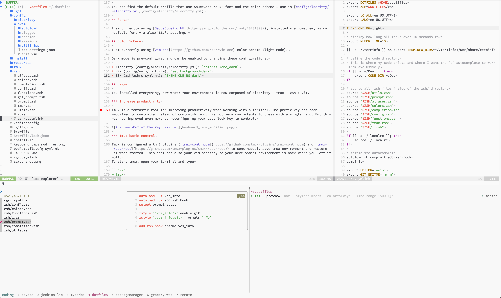
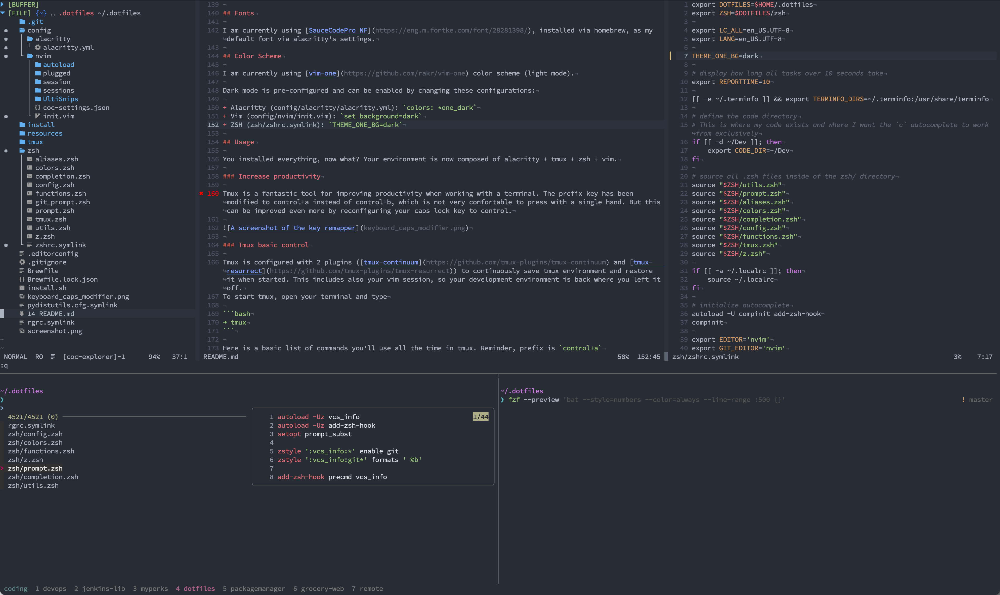

# Dotfiles

A collection of neovim, tmux, and zsh configurations for macOS. Built for DevOps workflows with Terraform, Python, YAML, and JSON.



## Contents

+ [Setup and Installation](#setup-and-installation)
+ [Terminal Capabilities](#terminal-capabilities)
+ [ZSH Setup](#zsh-setup)
+ [Neovim Setup](#neovim-setup)
+ [Tmux](#tmux-configuration)
+ [Herdr](#herdr-configuration)
+ [Terminal](#terminal-configuration)
+ [Fonts](#fonts)
+ [Color Scheme](#color-scheme)
+ [Usage](#usage)
+ [Claude Code](#claude-code)
+ [Troubleshooting](#troubleshooting)

## Setup and Installation

Clone the dotfiles repository to your home directory as `~/.dotfiles`.

```bash
git clone https://github.com/puffin/dotfiles.git ~/.dotfiles
cd ~/.dotfiles
```

### Backup

Run `install/backup.sh` to back up any existing symlinked files to `~/dotfiles-backup`. The installation scripts will not overwrite existing files.

### Installation

Install XCode CLI tools and Homebrew first:

```bash
xcode-select --install
```

Follow instructions at https://brew.sh/ to install Homebrew, then:

```bash
./install.sh
```

This will:
- Symlink all `*.symlink` files to your home directory (e.g. `zshrc.symlink` becomes `~/.zshrc`)
- Symlink the `config` directory contents to `~/.config/`
- Install Homebrew packages from `Brewfile`
- Run macOS-specific configurations via `install/osx.sh`, including remapping Caps Lock to Control on every keyboard (via `hidutil`, persisted with a LaunchAgent)

### Uninstallation

```bash
./uninstall.sh
```

Reverses the above: removes the symlinks (only if they still point at this repo), reverts the shell change, uninstalls exactly the packages/casks/taps listed in `Brewfile`, clears zinit/fzf/tf-helper/nvim/tmux-plugin caches, and deletes the specific macOS `defaults` keys `install/osx.sh` set. It prompts for confirmation before doing anything, since most of it is destructive, and it deliberately leaves `~/.ssh`, `~/.gnupg` (besides the generated `gpg-agent.conf`), and any nvim/tmux session history alone, since those can hold data of your own. Note `claude-code` is itself a Brewfile cask, so it gets uninstalled too.

## Terminal Capabilities

To support italic fonts in tmux:

```bash
tic -x resources/xterm-256color-italic.terminfo
tic -x resources/tmux.terminfo
```

## ZSH Setup

ZSH is configured in `zshrc.symlink`. Key features:

+ `EDITOR` set to `nvim`
+ Zinit plugin manager for zsh plugins
+ Sources `~/.localrc` for machine-specific config (API keys, etc.)
+ Custom prompt with git status on `RPROMPT`

### Git Prompt Symbols

+ `+` New files added
+ `!` Existing files modified
+ `?` Untracked files
+ `>>` Files renamed
+ `✘` Tracked file deleted
+ `$` Stashed files
+ `=` Unmerged files
+ `⇡` Branch ahead of remote
+ `⇣` Branch behind remote
+ `⇕` Branches diverged
+ `✔` Working directory clean

## Neovim Setup

Neovim is configured entirely in Lua with the following structure:

```
~/.config/nvim/
├── init.lua                  -- Entry point
└── lua/user/
    ├── options.lua           -- Editor settings
    ├── keymaps.lua           -- Key mappings
    ├── autocmds.lua          -- Autocommands
    ├── plugins.lua           -- Plugin declarations (lazy.nvim)
    └── lsp.lua               -- LSP server configuration
```

Plugins are managed by [lazy.nvim](https://github.com/folke/lazy.nvim) and installed automatically on first launch. Run `:Lazy` inside neovim to manage plugins.

### LSP and Autocompletion

Language servers are managed by [Mason](https://github.com/williamboman/mason.nvim) and configured via Neovim's native `vim.lsp.config` (0.11+). Autocompletion is powered by [blink.cmp](https://github.com/saghen/blink.cmp).

| Language   | Server        | Features                                    |
|------------|---------------|---------------------------------------------|
| Terraform  | terraformls   | Completions, diagnostics, prefill required fields |
| Python     | pyright + ruff| Pyright for completions/types, Ruff for linting/formatting |
| YAML       | yamlls        | Schema-aware completions (K8s, Docker Compose, GitHub Actions, etc.) |
| JSON       | jsonls        | Schema-aware completions (package.json, tsconfig, etc.) |

Schemas are provided by [SchemaStore.nvim](https://github.com/b0o/SchemaStore.nvim) (300+ schemas).

**Note:** For Terraform, run `terraform init` in each project directory for provider-aware completions.

### LSP Keymaps

| Key            | Action              |
|----------------|---------------------|
| `gd`           | Go to definition    |
| `gy`           | Go to type definition |
| `gi`           | Go to implementation |
| `gr`           | Find references     |
| `K`            | Show documentation  |
| `<leader>rn`   | Rename symbol       |
| `<leader>ca`   | Code action         |

### Completion Keymaps

| Key         | Action                |
|-------------|-----------------------|
| `Tab`       | Next completion       |
| `S-Tab`     | Previous completion   |
| `CR`        | Confirm selection     |
| `C-Space`   | Trigger / toggle docs |
| `C-e`       | Dismiss completion    |
| `C-b / C-f` | Scroll documentation  |

### Diagnostics

Diagnostics show inline virtual text, gutter signs, and underlines. Holding the cursor on an error line auto-opens a floating window with the full message.

### Plugins

**UI**: vim-one (colorscheme), lualine (statusline), nvim-web-devicons, vim-smoothie (smooth scrolling)

**Editor**: vim-surround, vim-repeat, vim-unimpaired, vim-sleuth, vim-abolish, Comment.nvim, splitjoin.vim, nvim-autopairs, editorconfig

**Git**: fugitive, gitsigns, diffview.nvim, vim-flog, vim-twiggy

**Navigation**: FZF (files, buffers, ripgrep), nvim-tree (file explorer)

**Session**: vim-obsession + vim-prosession (auto-save/restore sessions)

**Syntax**: Treesitter with parsers for Terraform, HCL, Python, TypeScript, JSON, YAML, Lua, and more

## Tmux Configuration

Tmux is configured in `~/.tmux.conf` with prefix set to `control+a`. Sessions are automatically saved every minute via tmux-continuum and restored on tmux start via tmux-resurrect.

### Tmux Commands

| Key                         | Action                    |
|-----------------------------|---------------------------|
| `prefix + I`                | Install plugins           |
| `prefix + U`                | Update plugins            |
| `prefix + w`                | Window/pane selection     |
| `prefix + c`                | New window                |
| `prefix + ,`                | Rename window             |
| `prefix + &`                | Kill window               |
| `prefix + [1-9]`            | Select window             |
| `prefix + -`                | Split vertically          |
| `prefix + \|`               | Split horizontally        |
| `prefix + x`                | Kill pane                 |
| `prefix + [h,j,k,l]`       | Move to pane              |
| `prefix + z`                | Toggle pane fullscreen    |
| `prefix + shift + [h,j,k,l]` | Resize pane             |

## Herdr Configuration

[Herdr](https://herdr.dev) is an agent-aware terminal multiplexer - it covers the same
sessions/windows/panes ground as tmux, plus status tracking for AI coding agents (Claude
Code, Codex, etc.) running in its panes. It's configured in `~/.config/herdr/config.toml`
with the same `control+a` prefix as tmux, so the muscle memory carries over. Both tools are
installed; use either as your daily driver, or reach for herdr specifically when running
coding agents you want to keep tabs on. Sessions persist across restarts and reattaches
natively, with no plugin manager needed.

### Herdr Commands

| Key                          | Action                    |
|-------------------------------|---------------------------|
| `prefix + w`                  | Workspace/agent picker    |
| `prefix + c`                  | New tab                   |
| `prefix + shift + t`          | Rename tab                |
| `prefix + shift + x`          | Close tab                 |
| `prefix + [1-9]`              | Select tab                |
| `alt + [1-9]`                 | Select tab (no prefix)    |
| `prefix + minus`              | Split stacked             |
| `prefix + \|`                 | Split side-by-side        |
| `prefix + x`                  | Close pane                |
| `prefix + [h,j,k,l]`          | Move to pane               |
| `prefix + z`                  | Toggle pane fullscreen    |
| `prefix + shift + [h,j,k,l]`  | Swap pane                 |
| `prefix + r`                  | Resize pane mode          |
| `prefix + [`                  | Copy mode (vim-style)     |
| `ctrl + shift + [left,right]` | Reorder current tab       |
| `prefix + q`                  | Detach                    |

### Herdr Plugins

Installed automatically by `install.sh` via `herdr plugin install` (source lives outside
this repo under `~/.config/herdr/plugins/`, gitignored - not vendored). The [marketplace](https://herdr.dev/plugins/)
is a self-tagged, unreviewed GitHub index; these were picked and their READMEs checked
by hand, not exhaustively vetted against the ~1000 plugins listed there.

| Plugin | What it does | Key |
|--------|--------------|-----|
| [herdr-auto-title](https://github.com/kryptamine/herdr-auto-title) | Renames tabs to match what's running in them | *(automatic)* |
| [vim-herdr-navigation](https://github.com/paulbkim-dev/vim-herdr-navigation) | `ctrl+h/j/k/l` crosses seamlessly between herdr panes and Neovim splits (vim-tmux-navigator, ported to herdr) | `ctrl + [h,j,k,l]` |
| [herdr-reviewr](https://github.com/persiyanov/herdr-reviewr) | Diff/review pane - comment on an agent's changes, send feedback back to it | `prefix + shift + c` |
| [herdr-sessionizer](https://github.com/andrewchng/herdr-sessionizer) | Fuzzy-open projects/worktrees, bootstrap a workspace layout from TOML | `prefix + shift + s` |
| [herdr-nvim](https://github.com/ChmaraX/herdr-nvim) | Full-height nvim sidebar + fuzzy file picker in a herdr pane | `prefix + shift + e` (toggle), `prefix + shift + o` (pick file) |

`herdr-sessionizer` needs `bun` to build (in the Brewfile via the `oven-sh/bun` tap).

## Terminal Configuration

Terminal of choice is [Alacritty](https://alacritty.org/). Configuration is in `config/alacritty/alacritty.yml`.

## Fonts

[SauceCodePro NF](https://eng.m.fontke.com/font/28281398/), installed via Homebrew.

## Color Scheme

[vim-one](https://github.com/rakr/vim-one) in light mode. Comments are displayed in light grey italic.

### Toggle Light/Dark

Press `Ctrl+x Ctrl+t` to toggle between light and dark themes. This works in both **neovim** and the **shell**, and switches all three simultaneously:

+ Neovim colorscheme (vim-one light/dark)
+ Alacritty terminal colors
+ Tmux status bar

You can also run `toggle-theme` from the command line, optionally with `light` or `dark` as an argument.

### Dark Theme



## Claude Code

[Claude Code](https://docs.anthropic.com/en/docs/claude-code) is integrated into Neovim via the [claudecode.nvim](https://github.com/coder/claudecode.nvim) plugin, providing an in-editor AI assistant panel.

### Claude Code Keymaps

Leader key is `Space`.

| Key              | Action                      |
|------------------|-----------------------------|
| `<leader>ac`     | Toggle Claude Code panel    |
| `<leader>as`     | Send selection to Claude    |
| `<leader>aa`     | Add current file to Claude  |
| `<C-w>`          | Navigate away from terminal (e.g. Claude panel) |

## Usage

### Vim Quick Reference

Leader key is `Space`.

| Key              | Action                      |
|------------------|-----------------------------|
| `<leader>k`      | Toggle file explorer (see [explorer keymaps](#file-explorer-keymaps)) |
| `<leader>st`     | Start screen                |
| `<leader>b`      | Close buffer (keep split)   |
| `<leader>t`      | Git file finder             |
| `<leader>e`      | All files finder            |
| `<leader>r`      | Buffer finder               |
| `<leader>s`      | Git status files            |
| `:Rg`            | Ripgrep search              |
| `<leader>gs`     | Git status                  |
| `<leader>gd`     | Git 3-way diff              |
| `gdh` / `gdl`   | Take left/right in diff     |
| `<leader>dvo`    | Open Diffview               |
| `<leader>dvc`    | Close Diffview              |
| `<leader>dvh`    | Diffview file history       |
| `]g` / `[g`      | Next/previous git hunk      |
| `gs`             | Preview git hunk            |
| `gu`             | Reset git hunk              |
| `gc` / `gcc`     | Comment toggle              |

### File Explorer Keymaps

The file explorer (nvim-tree) uses coc-explorer-style keybindings. Confirmations (y/n) are single-keypress — no Enter needed.

| Key    | Action                                  |
|--------|-----------------------------------------|
| `yy`   | Copy file/directory (toggle, visual mode supported) |
| `dd`   | Cut file/directory (toggle, visual mode supported)  |
| `p`    | Paste from clipboard                    |
| `df`   | Delete file/directory (trash)           |
| `dF`   | Delete permanently                      |
| `yp`   | Copy absolute path to system clipboard  |
| `yn`   | Copy filename to system clipboard       |
| `A`    | Create new directory                    |
| `a`    | Create new file                         |
| `E`    | Open in vertical split                  |
| `V`    | Visual select (then `yy`/`dd`/`df` for multi-file operations) |

Copied files are highlighted in green, cut files in red with strikethrough.

### Zsh Shortcuts

| Key                | Action                          |
|--------------------|---------------------------------|
| `Alt + Right/Left` | Move one word forward/backward  |
| `Cmd + Right/Left` | Move to end/beginning of line   |
| `Alt + D`          | Delete word after cursor        |
| `Alt + Backspace`  | Delete word before cursor       |
| `Ctrl + U`         | Clear entire line               |
| `Ctrl + R`         | Command history                 |
| `Ctrl + T`         | File history                    |

## Troubleshooting

If you encounter permission errors during installation:

```bash
sudo chown -R $(whoami):admin /usr/local/
sudo chmod -R 755 /usr/local
```

## Questions

If you have questions or notice issues, please open an [issue](https://github.com/puffin/dotfiles/issues/new).
