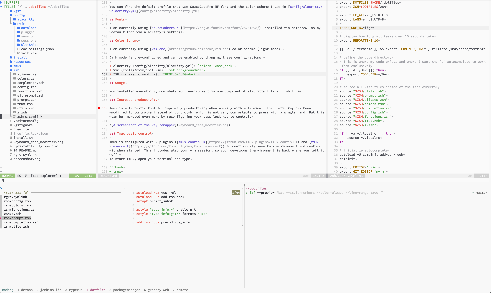

# Dotfiles

This is a collection of vim, tmux, and zsh configurations. This setup works for me, a DevOps engineer on macOS. It mights not works for you, but you can steal ideas from this and if you like, contribute back to it!



## Contents

+ [Setup and Installation](#setup-and-installation)
+ [Terminal Capabilities](#terminal-capabilities)
+ [ZSH Setup](#zsh-setup)
+ [Vim and Neovim Setup](#vim-and-neovim-setup)
+ [Tmux](#tmux-configuration)
+ [Terminal](#terminal-configuration)
+ [Fonts](#fonts)
+ [Usage](#usage)
+ [Troubleshooting](#troubleshooting)

## Setup and Installation

Clone the dotfiles repository to your home directory as `~/.dotfiles`.

```bash
➜ git clone https://github.com/puffin/dotfiles.git ~/.dotfiles
➜ cd ~/.dotfiles
```

### Backup

First, you may want to back up any existing files that exist, so this doesn't overwrite your work.

Run `install/backup.sh` to back up all symlinked files to a `~/dotfiles-backup` directory.

This will not delete any of these files, and the installation scripts will not overwrite any existing. After the backup is complete, you can delete the files from your home directory to continue installation.

### Installation

If on OSX, you will need to install the XCode CLI tools before continuing. To do so, open a terminal and type:

```bash
➜ xcode-select --install
```

Then install everything. Open a terminal and type:

```bash
➜ ./install.sh
```

`install.sh` will start by initializing the submodules used by this repo. Then, it will install all symbolic links into your home directory. Every file with a `.symlink` extension will be symlinked to the home directory with a `.` in front of it. As an example, `vimrc.symlink` will be symlinked in the home directory as `~/.vimrc`. Then, this script will create a `~/.vim-tmp` directory in your home directory, as this is where vim is configured to place its temporary files. Additionally, all files in the `config` directory will be symlinked to the `~/.config/` directory for applications that follow the [XDG base directory specification](http://standards.freedesktop.org/basedir-spec/basedir-spec-latest.html), such as neovim.

Next, the installation script will perform a check to see if it is running on an OSX machine. If so, it will install Homebrew if it is not currently installed and will install the homebrew packages listed in [`Brewfile`](Brewfile). Then, it will run [`osx.sh`](install/osx.sh) and change some OSX configurations.

## Terminal Capabilities

In order to properly support italic fonts of tmux, a couple of terminal capabilities need to be described. Run the following from the root of the project:

```bash
➜ tic -x resources/xterm-256color-italic.terminfo
➜ tic -x resources/tmux.terminfo
```

## ZSH Setup

ZSH is configured in the `zshrc.symlink` file, which will be symlinked to the home directory. The following occurs in this file:

+ set the `EDITOR` to nvim
+ Setup zplug plugin manager for zsh plugins and installed them.
+ source a `~/.localrc` if it exists so that additional configurations can be made that won't be kept track of in this dotfiles repo. This is good for things like API keys, etc.
+ And more...

### Prompt

The prompt is meant to be simple while still providing a lot of information to the user, particularly about the status of the git project, if the PWD is a git project. This prompt sets `precmd`, `PROMPT` and `RPROMPT`.

The git info shown on the `RPROMPT` displays the current branch name, and whether it is clean or dirty.

#### Git Prompt

The git info shown on the `RPROMPT` displays the current branch name, along with the following symbols.

+ `+` - New files were added
+ `!` - Existing files were modified
+ `?` - Untracked files exist that are not ignored
+ `»` - Current changes include file renaming
+ `✘` - An existing tracked file has been deleted
+ `$` - There are currently stashed files
+ `=` - There are unmerged files
+ `⇡` - Branch is ahead of the remote (indicating a push is needed)
+ `⇣` - Branch is behind the remote (indicating a pull is needed)
+ `⇕` - The branches have diverged (indicating history has changed and maybe a force-push is needed)
+ `✔` - The current working directory is clean

## Vim and Neovim Setup

[Neovim](https://neovim.io/) is a fork and drop-in replacement for vim. in most cases, you would not notice a difference between the two, other than Neovim allows plugins to run asynchronously so that they do not freeze the editor, which is the main reason I use it. Vim and Neovim both use Vimscript and most plugins will work in both. Neovim uses the [XDG base directory specification](http://standards.freedesktop.org/basedir-spec/basedir-spec-latest.html) which means it won't look for a `.vimrc` in your home directory. Instead, its configuration looks like the following:

|                         | Vim        | Neovim                    |
|-------------------------|------------|---------------------------|
| Main Configuratin File  | `~/.vimrc` | `~/.config/nvim/init.vim` |
| Configuration directory | `~/.vim`   | `~/.config/nvim`          |

Vim is likely already installed on your system. If using a Mac, MacVim will be installed from Homebrew. Neovim will also be installed from Homebrew by default on a Mac. For other systems, you may need to install Neovim manually. See their [web site](https://neovim.io) for more information.

[`link.sh`](install/link.sh) will symlink the XDG configuration directory into your home directory and will then create symlinks for `.vimrc` and `.vim` over to the Neovim configuration, so that Vim and Neovim will both be configured in the same way from the same files. The benefit of this configuration is that you only have to maintain a single vim configuration for both, so you can very seamlessly transition back to vim with no big impact to your productivity.

Inside [`.zshrc`](zsh/zshrc.symlink), the `EDITOR` shell variable is set to `nvim`, defaulting to Neovim for editor tasks, such as git commit messages. Additionally, I have aliased `vim` to `nvim` in [`aliases.zsh`](zsh/aliases.zsh) You can remove this if you would rather not alias the `vim` command to `nvim`.

Vim and neovim should just work once the correct plugins are installed. To install the plugins, you will need to open Neovim in the following way:

```bash
➜ nvim +PlugInstall
```

### LSP (Language Server Protocol)

Vim is configured with [coc.nvim](https://github.com/neoclide/coc.nvim) for full LSP support for your prefered languages. It makes vim as smart as VSCode with Intellisense engine.

Pre-configured suppport for python, elixir, ruby, JS and vim. Want more, just add them to `g:coc_global_extensions` and configure [coc-settings.json](config/nvim/coc-settings.json) accordingly.

Autocompletion navigation is set on the `<TAB>` key. Then some gotos keys are remapped as:

+ `gd` : Jump to definition(s) of current symbol
+ `gi` : Jump to implementation(s) of current symbol
+ `gr` : Jump to references of current symbol
+ `K` : Show documentation of the current symbol
+ `<leader> d` : Toggle linters on/off

## Tmux Configuration

Tmux is a terminal multiplexor which lets you create windows and splits in the terminal that you can attach and detach from. I use it to keep multiple projects open in separate windows and to create an IDE-like environment to work in where I can have my code open in vim/neovim and a shell open to run tests/scripts. Tmux is configured in [~/.tmux.conf](tmux/tmux.conf.symlink), and in [tmux/theme.sh](tmux/theme.sh), which defines the colors used, the layout of the tmux bar, and what what will be displayed. If not running on macOS, this configuration should be removed.

## Terminal Configuration

My terminal of choice is [Alacritty](https://alacritty.org/). This setup works great with it but should also work with your prefered one, though not tested.

You can find the default profile that use SauceCodePro NF font and the color scheme I use in [config/alacritty/alacritty.yml](config/alacritty/alacritty.yml)

## Fonts

I am currently using [SauceCodePro NF](https://eng.m.fontke.com/font/28281398/), installed via homebrew, as my default font via alacritty's settings.

## Color Scheme

I am currently using [vim-one](https://github.com/rakr/vim-one) color scheme (light mode).

Dark mode is pre-configured and can be enabled by changing these configurations:

+ Alacritty (config/alacritty/alacritty.yml): `colors: *one_dark`
+ Vim (config/nvim/init.vim): `set background=dark`
+ ZSH (zsh/zshrc.symlink): `zplug 'zsh-users/zsh-syntax-highlighting', defer:2, hook-load:"export ZSH_AUTOSUGGEST_HIGHLIGHT_STYLE=fg=239"`

## Usage

You installed everything, now what? Your environment is now composed of alacritty + tmux + zsh + vim.

### Increase productivity

Tmux is a fantastic tool for improving productivity when working with a terminal. The prefix key has been modified to control+a instead of control+b, which is not very confortable to press with a single hand. But this can be improved even more by reconfiguring your caps lock key to control.


### Tmux basic control

Tmux is configured with 2 plugins ([tmux-continuum](https://github.com/tmux-plugins/tmux-continuum) and [tmux-resurrect](https://github.com/tmux-plugins/tmux-resurrect)) to continuously save tmux environment and restore it when started. This includes also your vim session, so your development environment is back where you left it off.
To start tmux, open your terminal and type

```bash
➜ tmux
```

Here is a basic list of commands you'll use all the time in tmux. Reminder, prefix is `control+a`

+ `prefix + I` : install new tmux plugins
+ `prefix + U` : update tmux plugins
+ `prefix + w` : interactive window/pane selection
+ `prefix + :` : tmux shell
+ `prefix + $` : rename session
+ `prefix + c` : create a new window
+ `prefix + ,` : rename current window
+ `prefix + &` : kill current window
+ `prefix + [1, 2, 3, ...]` : select window
+ `prefix + -` : split new pane vertically
+ `prefix + |` : split new pane horizontally
+ `prefix + x` : kill current pane
+ `prefix + [h, j, k, l]` : move to pane
+ `prefix + z` : toggle pane fullscreen
+ `prefix + shift + [h, j, k, l]` : resize pane

### Zsh basic control

Here is a basic list of commands you'll use all the time in zsh.

+ `ALT + arrow right` : move one word forward
+ `ALT + arrow left` : move one word backward
+ `CMD + arrow right` : move to the end of the line
+ `CMD + arrow left` : move to the beginning of the line
+ `ALT + arrow down` : clear the characters on the line after the current cursor position
+ `ALT + arrow up` : clear the characters on the line before the current cursor position
+ `ALT + D` : delete the word after the cursor
+ `ALT + BACKSPACE` : delete the word before the cursor
+ `CTRL + U` : clear the entire line
+ `CTRL + R` : list commands history
+ `CTRL + T` : list files history

### Vim basic control

Vim is configured with various plugins to increase productivity. You can explore [config/nvim/init.vim](config/nvim/init.vim) to find out which plugins are installed.

To start vim, open your terminal and type

```bash
➜ vim
```

Here is basic list of commands you'll use all the time in vim. Reminder, the leader key is `SPACE`

+ `leader + k` : toggle file system explorer
+ `leader + y` : find the current file in the file system explorer
+ `leader + st` : toggle start screen
+ `leader + b` : close buffer but keep split
+ `leader + t` : Git fuzzy finder
+ `leader + e` : General fuzzy finder
+ `leader + r` : Buffer fuzzy finder
+ `control+w + s` : Split new buffer horizontally
+ `control+w + v` : Split new buffer vertically
+ `control+w [h, j, k, l]` : move to buffer
+ `:Rg` : Recursively searches directories for a regex pattern

Some more advanced commands.

+ `leader + gs` : Display Git Status
+ `leader + gd` : Open a Git 3-way split to resolve conflict
+ `gdh` : In Git 3-way split mode, get the change from the left pane (buffer with `//2` name)
+ `gdl` : In Git 3-way split mode, get the change from the right pane (buffer with `//3` name)
+ `]c` : Jumping to the next Git conflict to fix
+ `[c` : Jumping to the previous Git conflict to fix
+ `control+w + o` : Leave only the current pane open
+ `gd` : Goto definition
+ `gr` : Goto references
+ `do` : Automated changes or fixes for issue
+ `leader + gdo` : Open Diffview
+ `leader + gdc` : Close Diffview
+ `leader + gdh` : Open Diffview file history

## Troubleshooting

The automated installation can encounter errors around file permissions in case you don't have administrator access to the file system, or you're trying to install it under a new OS user. Open a terminal and type:

```bash
➜ sudo chown -R $(whoami):admin /usr/local/
➜ sudo chmod -R 755 /usr/local
```

## Questions

If you have questions, notice issues, or would like to see improvements, please open an [issue](https://github.com/puffin/dotfiles/issues/new) and I'm happy to help you out!
